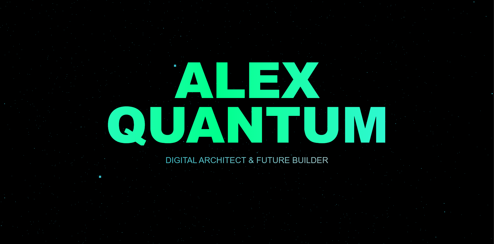

# Stellar Portfolio 🚀

A modern, animated portfolio template featuring 3D starfield background, dramatic typography, and smooth scrolling animations. Built with Three.js and GSAP.



## ✨ Features

- Interactive 3D starfield background
- Responsive design
- Smooth scroll animations
- Gradient text animations
- Modern glass-morphism cards
- Project showcase section
- Contact form
- Stats & skills display

## 🛠️ Technologies

- Three.js
- GSAP
- HTML5
- CSS3
- JavaScript

## 🚀 Quick Start

1. Clone the repository:
```bash
git clone https://github.com/ddosnotification/stellar-portfolio-template.git
```

2. Open `index.html` in your browser

3. Customize the content in `index.html` or `/css/style.css` or `/js/script.js`

## 🎨 Customization

### Colors
Edit the gradient colors in the CSS variables:
```css
background: linear-gradient(to right, #00eeff, #00ff88, #00eeff);
```

### Content
Replace the placeholder text in `index.html`:
- Name and title in the hero section
- Project details in the work section
- Stats and skills in the about section

### Background
Modify the starfield parameters in the JavaScript section:
```javascript
const starPositions = [];
for(let i = 0; i < 10000; i++) {
    // Adjust star count and position range
}
```

## 📱 Browser Support

- Chrome (latest)
- Firefox (latest)
- Safari (latest)
- Edge (latest)

## 📄 License

MIT License - feel free to use for your portfolio!

## 🤝 Contributing

1. Fork the repository
2. Create a feature branch
3. Commit changes
4. Push to branch
5. Open pull request

## ⭐ Show Your Support

Give a ⭐️ if you like this project!

## 📧 Contact

Questions? Feel free to open an issue or reach out to [me](https://x.com/ddosntfcion)

---
Created with 💙 by ddosnotification
